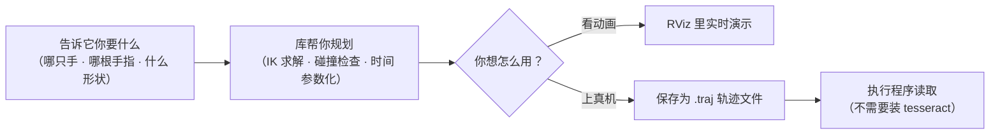
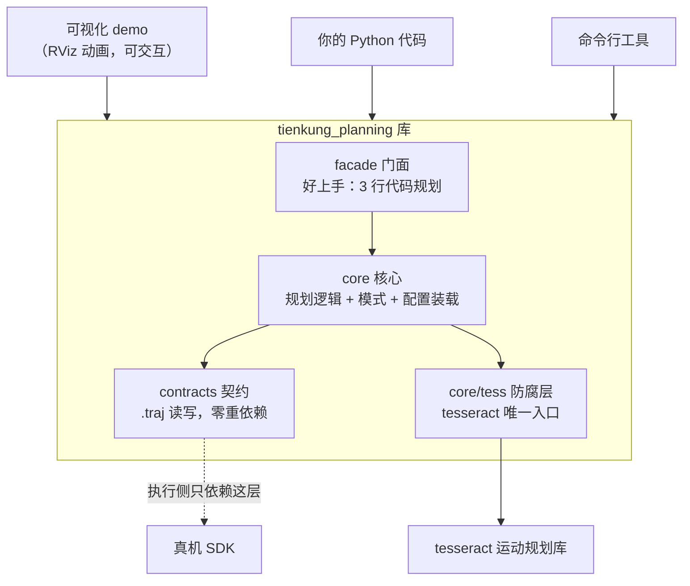

# 天工 Dex 双臂双手轨迹规划

给 TienKung Dex 人形机器人规划**双臂 + 灵巧手**的末端轨迹：让指尖沿圆、三角、
直线等形状精确描边。可以开 RViz 动画看效果，也可以当作 Python 库离线规划，
把轨迹文件交给真机执行程序。

## 一图看懂



## 快速开始

### 方式一：RViz 演示（看效果）

```bash
./run_rviz_sim.sh --arm both --mode full --waist free
```

机器人双臂镜像协同，指尖现场规划并沿形状描边。想改什么换什么参数：

| 参数 | 作用 |
|---|---|
| `--arm right\|left\|both` | 单臂或双臂镜像协同 |
| `--mode full\|fixed\|tcp` | 臂+指耦合全链 / 臂 7-DOF / 仅 tcp 基线 |
| `--waist free` | 腰 3 关节并入求解（够不着时放开腰） |
| `--fingers index,thumb` | 多指刚体联动（其余手指平行随动） |

### 方式二：Python 库（写代码）

```python
from tienkung_planning.facade import TienKungPlanner, PlannerOptions

planner = TienKungPlanner.from_profile("tienkung_dex",
                                       options=PlannerOptions(arm="both", waist="free"))
plan = planner.plan_shape("circle", size=0.10)
plan.save("circle.traj")          # 轨迹文件，交给执行侧
```

规划失败会抛 `PlannerError` 并带原因；还有两个独立能力件，不必进整套管线：

```python
from tienkung_planning.facade import CollisionApi, TimeParamApi

hits = CollisionApi.from_profile("tienkung_dex").check(q, joint_names)   # 碰撞检查
tp = TimeParamApi.from_profile("tienkung_dex").parameterize(Q, names)    # 时间参数化
```

### 方式三：命令行（脚本 / 跨机器）

```bash
python -m tienkung_planning.apps.traj_plan  --arm both --shape circle -o out/   # 规划
python -m tienkung_planning.apps.traj_check -i out/circle.traj --contacts       # 校验
python -m tienkung_planning.apps.traj_map   -i out/circle.traj --every 4        # 抽稀
python -m tienkung_planning.apps.time_param -i out/circle.traj                  # 时间参数化
```

## 轨迹文件去哪了

`.traj` 是一个 ZIP 包（`meta.json` + `arrays.npz`），自带内容 hash 和版本号。
**执行侧只装本库、不装 tesseract** 就能读：

```python
from tienkung_planning.contracts import PlanArtifact

plan = PlanArtifact.load("circle.traj")
q = plan.groups["right"].positions[0]     # 逐帧关节角 → 喂给 SDK
```

## 想改 / 想扩展

| 想做什么 | 怎么做 |
|---|---|
| 换一种机器人（同族变体） | 写一份 RobotProfile YAML（`src/tienkung_planning/robots/`），不改代码 |
| 加一种模式 | 实现 `ModeStrategy` 协议，注册进 `MODES` |
| 加一种形状 | 写一个普通函数 |
| 理解某层职责 | 见下方架构图 + `docs/封装方案.md` |

## 项目架构（简化版）

四层，依赖只准向下；tesseract 细节被隔离在 `core/tess.py` 一个文件里。



    src/tienkung_planning/
    ├── facade/        门面：TienKungPlanner / CollisionApi / TimeParamApi
    ├── core/          核心：规划管线、模式策略、profile 装载、校验
    ├── contracts/     契约：PlanArtifact 产物读写 + 异常（裸 venv 可 import）
    ├── robots/        机型配置 YAML（换机器人 = 换配置）
    └── apps/          命令行工具 ×4

## 改了代码？跑这些

```bash
tests/run_regression.sh                    # 19 种组合回归（改逻辑后必跑）
tests/run_golden.sh                        # 重捕 golden 基线
python tests/golden_compare.py tests/golden /tmp/golden_step0   # 与基线比对
python tests/test_facade.py                # 门面接口
python tests/test_contracts.py             # 产物契约
python tests/test_smoke_nomesh.py          # 无 mesh 冒烟
PYTHONPATH=src tests/bare_venv_import.sh   # 执行侧零依赖红线
```

## 更多文档

| 文档 | 内容 |
|---|---|
| `docs/封装方案.md` | 完整设计：契约定义、架构决策、评审记录 |
| `docs/扩展指南.md` | 接新机型 / 新模式的步骤 |
| `docs/实施计划.md` | 迁移过程与执行记录 |
