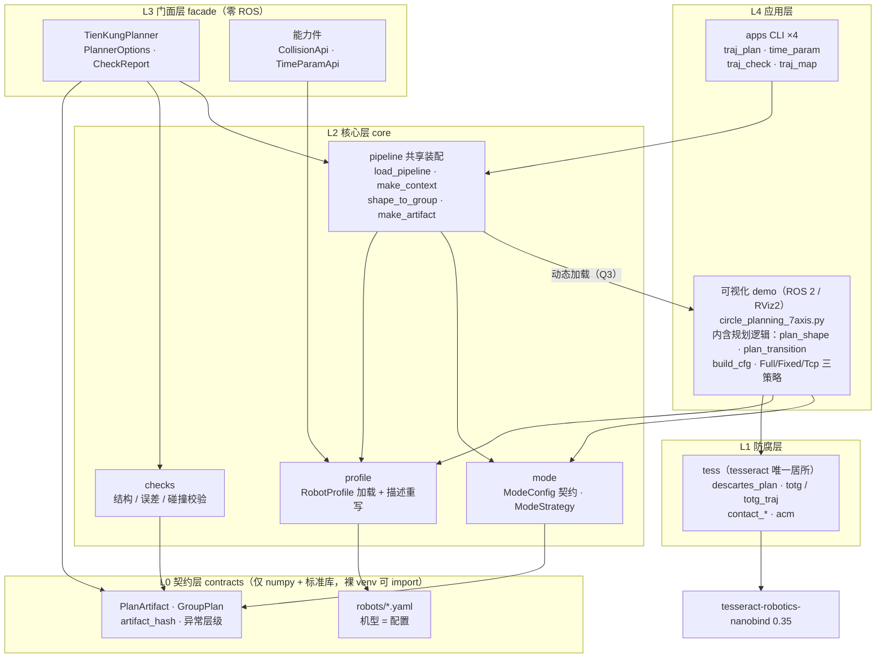

# 天工 Dex 双臂双手轨迹规划 Demo

基于 tesseract（nanobind bindings 0.35）+ ROS 2 Jazzy 的 TienKung Dex 人形机器人
双臂双手笛卡尔轨迹现场规划与 RViz2 演示。单进程运行，不产生任何中间文件。

当前版本：`v0.1.0`（库化完成锚点）→ **v0.2**（facade 门面三件落地）。

## 能力

- 双臂：`--arm right|left|both`（左臂种子由 2⁷ 符号模式 FK 搜索自动镜像标定）
- 腰部冗余：`--waist free` 将腰 3 关节并入变量空间（both 时腰归右臂、左臂冻结）
- 手指：五指任选（欠驱动耦合显式参数化，补偿 tesseract 不识别 URDF `<mimic>`）；
  `--fingers index,thumb` 多指刚体联动（手型保持、副指平行随动，仅验证不做约束）
- 末端模式：`full`（臂+指耦合全链）/ `fixed`（手指定值+臂 7-DOF）/ `tcp`（回归基线）
- 轨迹质量：TOTG 时间参数化、形状间过渡轨迹（碰撞扫描+随机路标绕行）、
  启动可达性预检、失败原因可视化
- 精度：主指尖路径误差 ≤0.01mm，多指随动误差 ≤0.009mm；单形状规划 0.2–1.7s

## 运行

```bash
./run_rviz_sim.sh                            # 右臂食指，full 模式，四种形状轮换
./run_rviz_sim.sh --arm both --mode full     # 双臂镜像协同
./run_rviz_sim.sh --waist free               # 腰 3 关节并入变量空间
./run_rviz_sim.sh --fingers index,thumb      # 多指刚体联动
./run_rviz_sim.sh --fingers index,thumb --waist free   # 组合使用
```

环境依赖：conda env `dex`（Python 3.12 + tesseract-robotics-nanobind），
ROS 2 Jazzy（robot_state_publisher / rviz2）。详见 `run_rviz_sim.sh`。

## 回归

```bash
tests/run_regression.sh    # 15 单指组合 + 4 多指组合 × 4 形状，headless ALL PASS
```

## 作为库使用（tienkung_planning）

包结构（封装方案 v2.1.1，`docs/封装方案.md`）：

    src/tienkung_planning/
    ├── contracts/        L0 产物契约（PlanArtifact 读写 + 异常层级，import 零第三方依赖）
    ├── core/             L1+L2：tess.py（tesseract 唯一居所）+ profile/mode/pipeline/checks
    ├── facade/           L3 门面：TienKungPlanner / CollisionApi / TimeParamApi
    ├── robots/           RobotProfile YAML（机型 = 配置）
    └── apps/             L4 CLI：traj_plan / time_param / traj_check / traj_map

### 项目架构

五层架构，依赖只准向下；两条 CI 红线：① L0 不 import 本库任何上层；
② tesseract 只出现在 `core/tess.py`。demo（Q3 决策）留在仓库根作**管线宿主**
——规划逻辑（`plan_shape`/`build_cfg`/三策略）住在 demo 里，facade 与 CLI
经 `core.pipeline.load_pipeline()` 动态加载复用它。



### 接口框架

对应封装方案 §13.1 的四种典型用法；规划与执行经 `.traj` 产物解耦
（ZIP = `meta.json` + `arrays.npz`，`artifact_hash` 内容寻址、排除
`created_at` 与 schema 版本号）。

```mermaid
flowchart LR
    subgraph offline ["离线规划侧（需装 tesseract）"]
        u1 ["① 门面<br>TienKungPlanner.from_profile<br>plan_shape / plan_transition / check"]
        u2 ["② 能力件按能力取用<br>CollisionApi.check(states, joint_names)<br>TimeParamApi.parameterize(Q, joint_names)"]
        u4 ["④ CLI 子进程（跨解释器）<br>python -m tienkung_planning.apps.traj_plan"]
    end

    traj [".traj 产物<br>kind = shape / transition<br>含逐关节限位 + acm_hash + 误差统计"]

    subgraph exec ["在线执行侧（裸 venv，零 tesseract）"]
        u3 ["③ PlanArtifact.load<br>各侧 positions → SDK"]
        hw ["hand_controller / 真机 SDK"]
    end

    u1 -- "plan.save()" --> traj
    u4 -- "-o out.traj" --> traj
    traj -- "ZIP 读写（major 版本拒绝 / minor 前向兼容）" --> u3
    u3 --> hw
    u2 -. "纯 numpy 入出参<br>不抛 tesseract 类型" .-> res["研究 / 仿真代码"]
```

| 接口 | 层 | 用途 |
|---|---|---|
| `TienKungPlanner.from_profile(profile, options)` | L3 | 一键形状/过渡规划 → `PlanArtifact` |
| `PlannerOptions(arm, mode, waist, finger, fingers, offset)` | L3 | 会话选项（与 demo argparse 一一对应） |
| `CollisionApi.from_profile(profile).check(states, joint_names)` | L3 | 独立碰撞检查（接触对列表） |
| `TimeParamApi.from_profile(profile).parameterize(Q, joint_names)` | L3 | 独立时间参数化 → `TimedTrajectory` |
| `PlanArtifact.load / save / artifact_hash` | L0 | 产物读写（执行侧零依赖） |
| `apps` CLI ×4 | L4 | 脚本化/跨解释器等价入口 |
| `PlannerError / UnavailableError / ContractVersionError` | L0 | 异常层级（§4.3） |

B6 约定：一实例 = 一 env = 一线程，`from_profile` 时装载、无全局缓存、
不跨线程共享；`plan_transition` 仅接受同实例产物（profile_hash + 关节表校验）。

```python
# 门面（v0.2）：组合便捷入口或按能力取用
from tienkung_planning.facade import TienKungPlanner, PlannerOptions
planner = TienKungPlanner.from_profile("tienkung_dex",
                                       options=PlannerOptions(arm="both", waist="free"))
plan = planner.plan_shape("circle", size=0.10)
plan.save("circle.traj")
```

```bash
# CLI 等价入口
python -m tienkung_planning.apps.traj_plan --arm both --mode full --waist free \
    --shape circle -o out/
# 执行侧（无需装 tesseract）读产物
python -m tienkung_planning.apps.traj_check -i out/circle.traj
python -m tienkung_planning.apps.traj_map  -i out/circle.traj -o mapped.traj --every 4
# 时间参数化（URDF 须含 velocity 限位）
python -m tienkung_planning.apps.time_param -i mapped.traj
```

扩展方式见 `docs/扩展指南.md`；消费方式（组合而非继承、submodule 优先）
见 `docs/封装方案.md` §13。

## 测试

```bash
tests/run_golden.sh                 # 19 组合 golden 基线（19/19 ALL PASS）
python tests/golden_compare.py tests/golden /tmp/golden_step0
python tests/test_contracts.py      # 契约往返/版本拒绝
python tests/test_smoke_nomesh.py   # 无 mesh 管线骨架
python tests/test_facade.py         # 门面三件（§13.1 用法①②）
PYTHONPATH=src tests/bare_venv_import.sh   # N9 裸 venv import 红线
```
